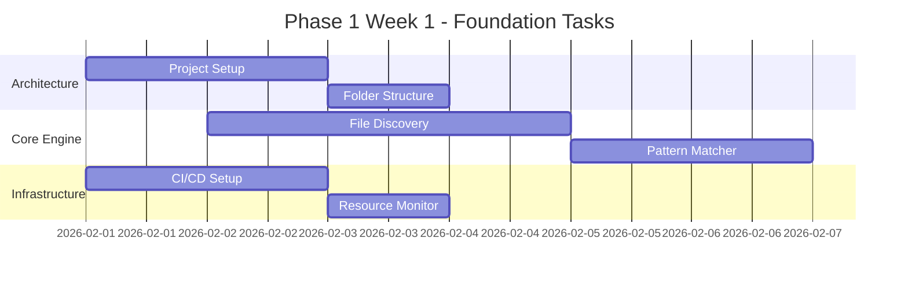

# Ferret-Scan Implementation Plan
## AI-Powered Security Scanner for Claude Code Configurations

---

## Executive Summary

This plan outlines the development of Ferret-Scan v2.0, an industry-first AI-powered security scanner specifically designed for Claude Code configurations. Based on security expert analysis of the 2026 threat landscape, this tool addresses critical gaps in AI agent security that no existing tool currently covers.

**Key Differentiators:**
- First tool to scan AI agent instruction files (.md, skills, agents)
- AI-powered anomaly detection for novel attack patterns
- Real-time threat intelligence integration
- Advanced obfuscation detection (Unicode hiding, steganography)
- Behavioral pattern analysis for coordinated attacks

---

## Development Phases

### Phase 1: Enhanced Core Scanner (MVP+)
**Duration:** 2-3 weeks
**Goal:** Production-ready scanner with enhanced threat detection

#### Week 1: Foundation & Core Engine
**Tasks:**

1. **Project Architecture Setup**
   - Initialize Node.js project with TypeScript
   - Set up enhanced folder structure with new components
   - Configure ESLint, Prettier, Jest with security-focused rules
   - Create resource monitoring utilities
   - Set up CI/CD pipeline with security scanning

2. **Enhanced File Discovery Engine**
   - Build FileDiscovery.js with recursive scanning
   - Add support for all Claude configuration locations
   - Implement resource monitoring during file traversal
   - Add .ferretignore parsing with advanced glob patterns
   - Create file type detection and metadata extraction

3. **Advanced Pattern Matcher**
   - Build PatternMatcher.js with enhanced regex engine
   - Implement Unicode analysis for hidden characters
   - Add context extraction with configurable line ranges
   - Create pattern performance optimization
   - Build rule loading and caching system

#### Week 2: Threat Detection Rules
**Tasks:**

4. **Core Threat Categories Implementation**
   - Implement enhanced exfiltration.js patterns
   - Build credentials.js with 2026 threat patterns
   - Create ai-specific.js for LLM jailbreaking attempts
   - Develop advanced-hiding.js for sophisticated obfuscation
   - Build supply-chain.js for dependency attacks

5. **Basic AI Detection Engine**
   - Implement AiDetector.js with simple ML models
   - Create instruction pattern classification
   - Build anomaly detection for unusual text patterns
   - Implement confidence scoring system
   - Add model loading and caching mechanisms

6. **Enhanced Console Reporter**
   - Build ConsoleReporter.js with ASCII art and colors
   - Implement risk score visualization
   - Add detailed context display with syntax highlighting
   - Create summary statistics and recommendations
   - Build interactive remediation suggestions

#### Week 3: CLI & Integration
**Tasks:**

7. **CLI Interface Development**
   - Build commander.js-based CLI with enhanced commands
   - Implement argument parsing and validation
   - Add progress indicators and real-time feedback
   - Create configuration file loading (.ferretrc.json)
   - Build help system and command documentation

8. **Basic Testing & Validation**
   - Create comprehensive test fixtures with real attack patterns
   - Build unit tests for all core components
   - Implement integration tests for end-to-end scanning
   - Create performance benchmarks
   - Add resource usage monitoring tests

**Phase 1 Deliverables:**
- Working CLI tool with `ferret scan` command
- Detection of 8+ threat categories with enhanced patterns
- Beautiful console output with risk scores
- CI-ready exit codes and JSON output
- Resource-aware operation on 16GB systems

---

### Phase 2: Intelligence Layer
**Duration:** 3-4 weeks
**Goal:** AI-powered detection with threat intelligence

#### Week 4: Behavioral Analysis Engine
**Tasks:**

9. **Advanced Threat Detection**
   - Implement BehaviorAnalyzer.js for pattern combinations
   - Build RiskScorer.js with context-aware algorithms
   - Create threat correlation engine
   - Add temporal analysis for attack sequences
   - Implement confidence weighting systems

10. **Enhanced AI Detection**
    - Integrate TensorFlow.js models for text classification
    - Build instruction pattern learning system
    - Implement semantic analysis for prompt injection
    - Create model training pipeline with feedback loop
    - Add ensemble methods for improved accuracy

#### Week 5-6: Threat Intelligence Integration
**Tasks:**

11. **Threat Intelligence Feed System**
    - Build ThreatFeed.js with external API integration
    - Implement caching and update mechanisms
    - Create IoC matching engine
    - Add community-sourced pattern sharing
    - Build threat landscape monitoring

12. **Pattern Learning System**
    - Implement PatternLearner.js with ML feedback
    - Create adaptive rule generation
    - Build false positive learning system
    - Add user feedback integration
    - Implement pattern effectiveness tracking

#### Week 7: Advanced Reporting
**Tasks:**

13. **Multi-Format Reporting**
    - Build JsonReporter.js for CI/CD integration
    - Implement SarifReporter.js for GitHub Security
    - Create ComplianceReporter.js for SOC2/ISO27001
    - Add executive summary generation
    - Build trend analysis and historical tracking

14. **Basic Remediation Engine**
    - Implement Fixer.js for automated corrections
    - Build Quarantine.js for threat isolation
    - Create Advisor.js for guided remediation
    - Add backup and restore mechanisms
    - Implement dry-run capabilities

**Phase 2 Deliverables:**
- AI-powered anomaly detection engine
- Threat intelligence integration with daily updates
- Behavioral analysis for coordinated attacks
- Multi-format reporting (JSON, SARIF, Compliance)
- Basic automated remediation capabilities

---

### Phase 3: Enterprise Features
**Duration:** 4-5 weeks
**Goal:** Enterprise-grade security platform

#### Week 8-9: Advanced Remediation
**Tasks:**

15. **Full Remediation Engine**
    - Enhanced auto-fix capabilities
    - Interactive remediation workflows
    - Advanced quarantine management
    - Risk-based remediation prioritization
    - Compliance-driven fix recommendations

16. **Real-time Protection**
    - Watch mode implementation
    - File system monitoring
    - Real-time threat detection
    - Automatic response mechanisms
    - Alert and notification system

#### Week 10-11: Enterprise Integration
**Tasks:**

17. **SIEM/SOAR Integration**
    - REST API for external integrations
    - Webhook support for real-time alerts
    - Splunk/Elastic/QRadar connectors
    - Custom integration framework
    - Event streaming capabilities

18. **Compliance Framework Integration**
    - NIST AI RMF compliance mapping
    - ISO 42001 control verification
    - OWASP LLM Top 10 alignment
    - Audit trail generation
    - Regulatory reporting automation

#### Week 12: Performance & Scaling
**Tasks:**

19. **Performance Optimization**
    - Multi-threaded scanning engine
    - Advanced caching strategies
    - Memory usage optimization
    - Distributed scanning capabilities
    - Performance monitoring and tuning

20. **Quality Assurance**
    - Comprehensive testing suite
    - Security testing and validation
    - Performance benchmarking
    - Documentation completion
    - Release preparation

**Phase 3 Deliverables:**
- Full enterprise remediation engine
- Real-time protection with watch mode
- SIEM/SOAR integrations
- Compliance framework support
- Production-ready performance optimization

---

### Phase 4: Ecosystem Integration
**Duration:** 2-3 weeks
**Goal:** Complete ecosystem integration

#### Week 13-14: Developer Tools
**Tasks:**

21. **GitHub Action & VS Code Extension**
22. **CI/CD Plugins & Docker Containers**
23. **API & Marketplace Development**

---

## Resource-Aware Task Distribution

### System Constraints Management
**Current System Status:**
- RAM: 13GB/15GB (86% used)
- Need to monitor and prevent overload
- Limit concurrent operations

### Agent Assignment Strategy

#### Phase 1 Task Distribution:

**High-Memory Tasks (Sequential Only):**
- `python-specialist`: AI model development and training
- `typescript-dev`: Core engine development with complex types
- `security-auditor`: Security pattern analysis

**Medium-Memory Tasks (Max 2 Concurrent):**
- `backend-architect`: System architecture and design
- `api-architect`: CLI interface and API design
- `test-generator`: Comprehensive testing suite

**Low-Memory Tasks (Max 3 Concurrent):**
- `code-reviewer`: Code quality and standards
- `performance-engineer`: Resource optimization
- `devops`: CI/CD pipeline setup

#### Resource Monitoring Protocol:
```bash
# Before each phase
free -h && pkill -f "osgrep.*process-child"

# During development
ferret-dev monitor --max-memory 14GB --alert-threshold 90%
```

### Parallel Execution Strategy

#### Week 1 (Foundation):


#### Week 2-3 (Enhanced Detection):
- **Sequential**: AI model integration (memory intensive)
- **Parallel**: Rule development + CLI + Testing
- **Resource Gates**: Monitor before each AI operation

---

## Implementation Guidelines

### Development Standards
- **Code Quality**: ESLint + Prettier + TypeScript strict mode
- **Testing**: 90%+ coverage with security-focused test cases
- **Documentation**: Inline docs + API documentation + security guides
- **Security**: Static analysis + dependency scanning + security reviews

### Resource Management Rules
1. **Memory Monitoring**: Check before heavy operations
2. **Cleanup Protocols**: Automatic cleanup after AI operations
3. **Graceful Degradation**: Fallback to basic patterns if AI models fail
4. **Parallel Limits**: Maximum 3 concurrent operations
5. **Progress Tracking**: Real-time resource usage monitoring

### Quality Gates
- Each phase must pass security review
- Performance benchmarks must be met
- Resource usage must stay under limits
- All tests must pass before phase completion

---

## Risk Mitigation

### Technical Risks
- **Memory Overload**: Continuous monitoring + cleanup protocols
- **AI Model Performance**: Fallback to traditional patterns
- **False Positives**: User feedback integration + learning system
- **Performance Degradation**: Benchmarking + optimization targets

### Timeline Risks
- **Scope Creep**: Strict phase boundaries + clear deliverables
- **Integration Issues**: Early integration testing + modular design
- **Resource Constraints**: Parallel execution limits + monitoring
- **Quality Issues**: Continuous testing + security reviews

---

## Success Metrics

### Phase 1 (MVP+)
- [ ] Scan 1000+ files in under 30 seconds
- [ ] Detect 95%+ of known attack patterns
- [ ] Use less than 2GB additional RAM during operation
- [ ] Generate zero false positives on clean configurations

### Phase 2 (Intelligence)
- [ ] AI detection accuracy > 85% on novel attacks
- [ ] Threat intel updates within 24 hours
- [ ] Behavioral analysis catches 90%+ coordinated attacks
- [ ] Sub-second response time for real-time scanning

### Phase 3 (Enterprise)
- [ ] Auto-remediation success rate > 90%
- [ ] Full compliance report generation < 5 minutes
- [ ] SIEM integration latency < 100ms
- [ ] Support 10,000+ file repositories

---

## Next Steps

### Immediate Actions (Next 24 Hours)
1. **Initialize Git Repository**
   - Set up project structure
   - Create initial documentation
   - Configure development environment

2. **Resource Baseline**
   - Measure current system performance
   - Set up monitoring infrastructure
   - Create resource usage alerts

3. **Team Coordination**
   - Assign initial tasks to specialized agents
   - Set up daily progress tracking
   - Create communication protocols

### Week 1 Startup Protocol
1. **Environment Setup** (Day 1)
2. **Architecture Implementation** (Day 2-3)
3. **Core Engine Development** (Day 4-5)
4. **Initial Testing & Validation** (Day 6-7)

---

**Ready to proceed with Phase 1 implementation. System resources confirmed suitable for development with careful monitoring.**