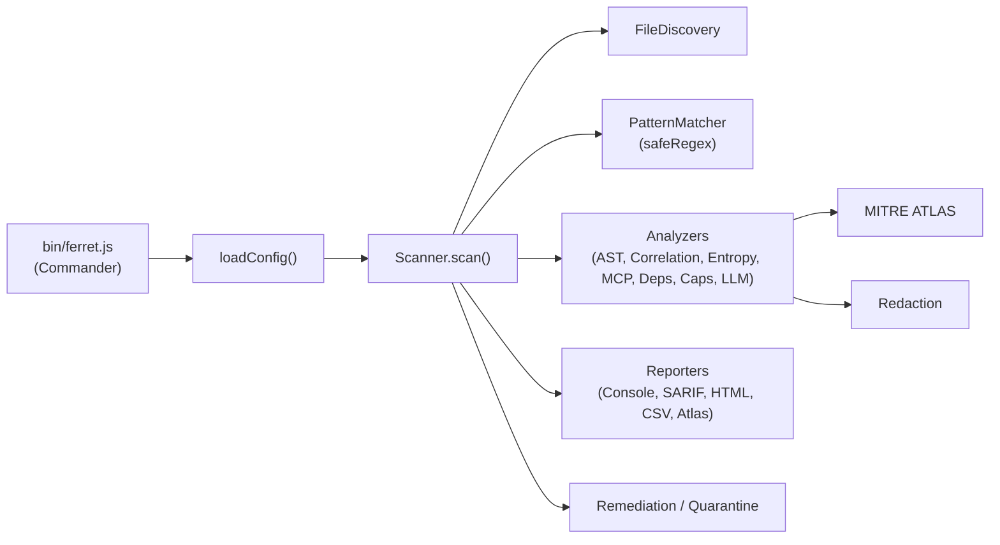
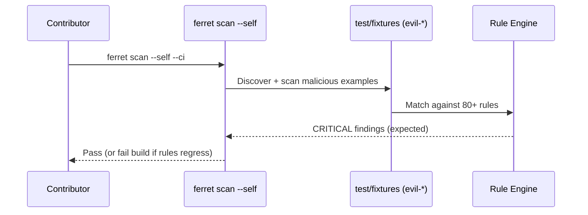
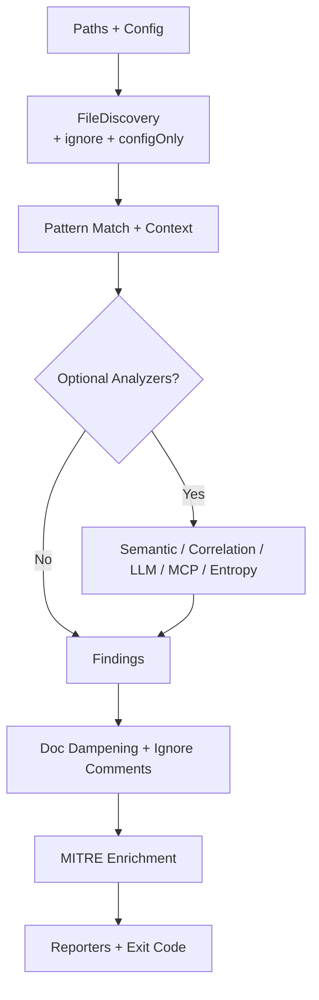
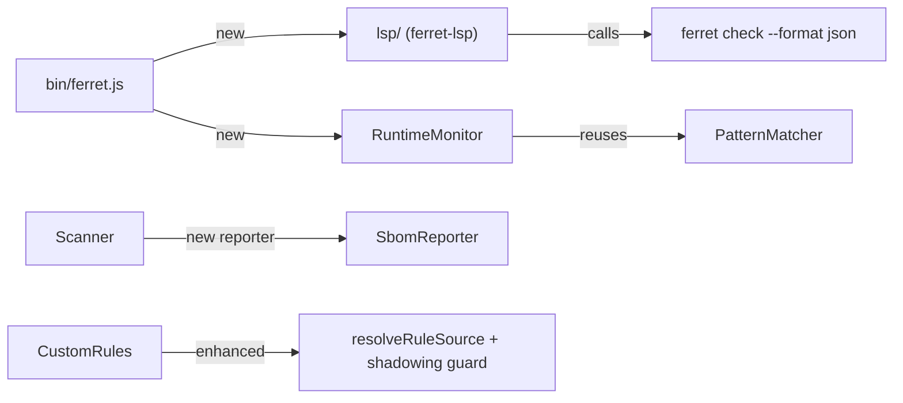

# Architecture

Ferret is a CLI security scanner for AI assistant configuration files. The scanner focuses on known AI CLI formats (Claude Code, Cursor, Windsurf, Continue, Aider, Cline) and generic AI configs.

## Core Components

- **CLI** (`bin/ferret.js`): argument parsing, config loading, scan orchestration, reporting, and exit codes.
- **Config & Ignore** (`src/utils/config.ts`, `src/utils/ignore.ts`): merges CLI options with `.ferretrc` and `.ferretignore`.
- **File Discovery** (`src/scanner/FileDiscovery.ts`): finds relevant config, markdown, JSON, YAML, and shell files.
- **Rule Engine** (`src/scanner/PatternMatcher.ts`, `src/rules/*`): RE2-based matching (no ReDoS) with context filters and severity. User-supplied patterns are compiled via `compileSafePattern` for additional defense.
- **Semantic Analysis** (`src/analyzers/AstAnalyzer.ts`): AST-based checks for JS/TS and code blocks in markdown, with per-block (500ms) and per-file (2s) deadlines.
- **Correlation Analysis** (`src/analyzers/CorrelationAnalyzer.ts`): cross-file pattern correlation.
- **Threat Intelligence** (`src/intelligence/*`): indicator matching against a local threat database (no external feeds by default).
- **LLM Analysis** (`src/features/llmAnalysis.ts`): optional LLM-assisted scanning with redaction and caching (disabled by default).
- **MCP Trust Scoring** (`src/features/mcpTrustScore.ts`): scores `.mcp.json` servers (transport, package pinning, suspicious args, known-bad patterns); surfaced via `ferret mcp audit`.
- **Custom Rules** (`src/features/customRules.ts`): load user-defined rules from `.ferret/rules.*` or `--custom-rules`. All patterns RE2-validated before load.
- **MITRE ATLAS Catalog** (`src/mitre/atlasCatalog.ts`): optional cached download of the official STIX bundle for up-to-date technique metadata.
- **Remediation** (`src/remediation/*`): safe auto-fix and quarantine helpers (path-traversal hardened; quarantine dir mode 0700 on POSIX).
- **Reporters** (`src/reporters/*`): console, JSON, SARIF (with MCP trust summary), HTML, and CSV outputs. Secrets are redacted by default.

## Data Flow (Scan)

1. CLI loads config and resolves scan paths.
2. File discovery collects analyzable files and applies ignore rules.
3. Pattern matching runs across files and rules.
4. Optional semantic and correlation analyses run if enabled.
5. Optional threat intel matching runs if enabled (local indicator set).
6. Findings are sorted, summarized, and reported.
7. Exit code is determined by severity threshold.

## Files Analyzed

Ferret focuses on AI CLI configs plus related scripts:

- `CLAUDE.md`, `.mcp.json`, `.claude/`, `settings.json`
- `.cursorrules`, `.cursor/`
- `.windsurfrules`, `.windsurf/`
- `.continue/`
- `.aider/`, `.aider.conf.yml`, `.aiderignore`
- `.cline/`, `.clinerules`
- `.ai/`, `AI.md`, `AGENT.md`, `AGENTS.md`
- Markdown, JSON, YAML, and shell scripts in these trees

## Outputs

- `console`: human-friendly terminal output
- `json`: machine-readable
- `sarif`: GitHub code scanning integration
- `html`: standalone report
- `csv`: flat export for spreadsheets

## Extensibility

- Add new rules in `src/rules/`.
- Use `.ferretrc.json` for default settings and ignore patterns.
- Use `ferret rules` and `ferret baseline` to manage rules and accepted findings.

## Diagrams

### Core Component Overview

### Self-Scan Dogfooding Loop (Phase 3)

### Data Flow for a Thorough Scan

## New Features (v2.6+)

### SBOM + AIBOM Generation
`SbomReporter` produces CycloneDX 1.5 and an AI-specific AIBOM extension containing:
- Prompt injection / credential / exfiltration surface
- MCP server trust summary
- Capability and risk posture

Invoked via `--format sbom|aibom` or `--sbom`.

### Community Rule Sharing
- `resolveRuleSource()` converts `github:owner/repo@ref/path` shorthand into raw URLs
- `loadCustomRulesSource` + `validateCustomRulesFile` now enforce **ID shadowing protection** (custom rules cannot override built-in rule IDs)
- New commands: `ferret rules validate|fetch|install`

### Language Server Protocol (`lsp/` package)
Standalone `ferret-lsp` package provides:
- Real-time diagnostics (via `ferret check --format json`)
- Hover on rule IDs (pulls from rule registry)
- Completion for severities, categories, and rule IDs in config files

Launched via `ferret lsp` or directly as `ferret-lsp`.

### Lightweight Runtime Prompt Monitor
`runtimeMonitor.ts` implements `scanPrompt()` + `startRuntimeMonitor()`:
- Reuses `PatternMatcher` + high-signal rule subset for speed
- Supports `--stdio` (pipe) and `--target` (wrapper) modes
- Alerting-only by default; `--block` for enforcement
- Emits structured JSON alerts to stderr

Designed for live interception during `claude`, `cursor`, or any LLM CLI usage without heavy resource monitoring.

### Component Addition Diagram

